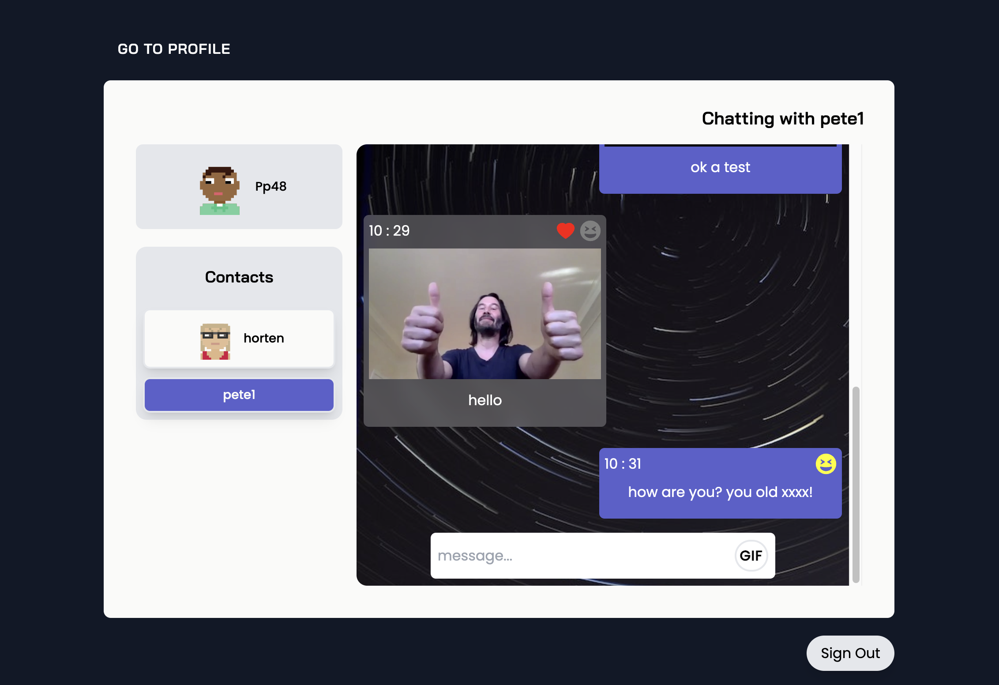

# Pixel chat



## Deployment

:rocket: **Deployed** with Netlify at [pixel-chat](https://pilks-pixel-chat.netlify.app/)

## About

Pixel Chat allows users to share instant messages and gifs with others that can interact with their posts.
In this project, the frontend uses **React** and **Tailwind** CSS. While **Socket IO** handles web socket functionality for messaging.

The backend API was built in **Node.js** giving full **C.R.U.D** functionality and utilizes **MongoDB**, **bcrypt** and **JWT** for storage, encryption and authentication of user credentials, as well as authorization for login.

## Instructions

Clone down to local machine, `npm install` and `cd socket-chat`

`npm run start` to run the client.

The backend API can be found at [https://github.com/Pilks-pixel/Socket-Chat-Backend](https://github.com/Pilks-pixel/Socket-Chat-Backend).

Open [http://localhost:3000](http://localhost:3000) to view it in your browser, when both client and server are running.

## Wins

-[x] Instant messaging and updates through **Socket IO**.

-[x] Login / registration form with input **validation**.

-[x] Accessibility consideration and Mobile first design made using **Tailwind CSS**.

-[x] User authorization enabled with **React router** &amp; private route components using local storage and **JWT**.

-[x] **Regex** abusive content filter.

## Significant code

```javascript
// Creates array of random gif objects and uses recursion to ensure there are no duplicates. Then renders each as a selectable / keyboard accessible image. 
useEffect(() => {
		if (gifData.length > 0) {
			const randomGifs = [];

			function addGif() {
				let seed = gifData[randomInt(gifData.length)];

				if (!randomGifs.includes(seed)) {
					return randomGifs.push(seed);
				} else {
					addGif();
				}
			}

			for (let i = 0; i < 6; i++) {
				addGif();
			}

			setGifArray(randomGifs);
		}
	}, [displayGifs]);

	const gifMenu = gifArray.map(gif => {
		return (
			<button key={gif.keyId} onClick={e => selectGif(e)}>
				
			</button>
		);
	});
```
